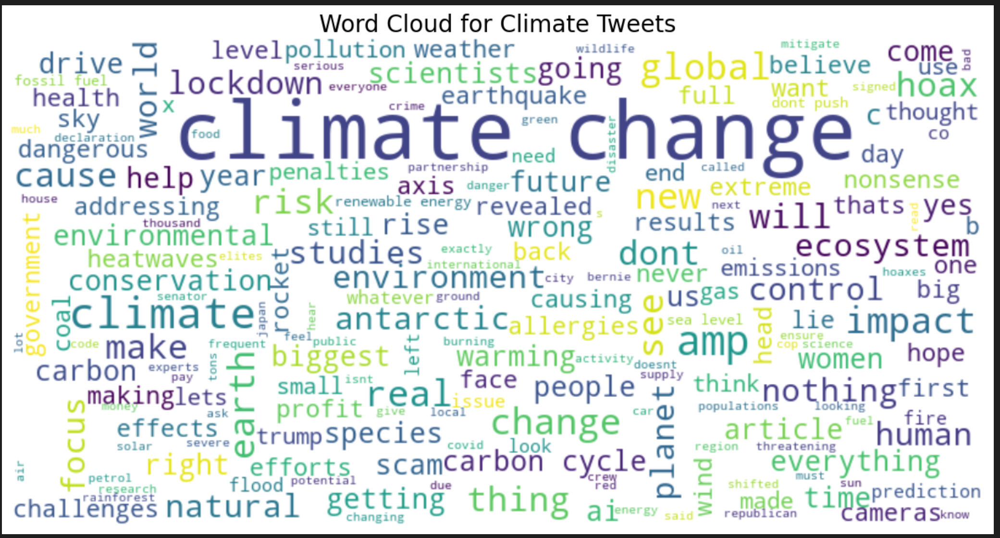
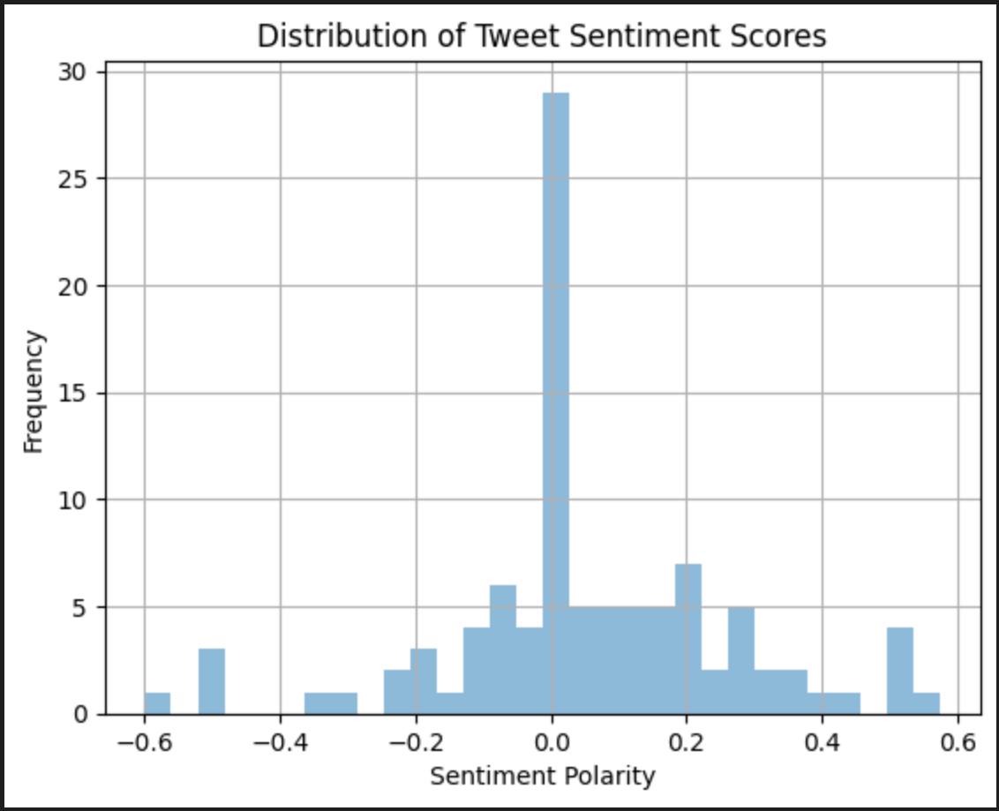
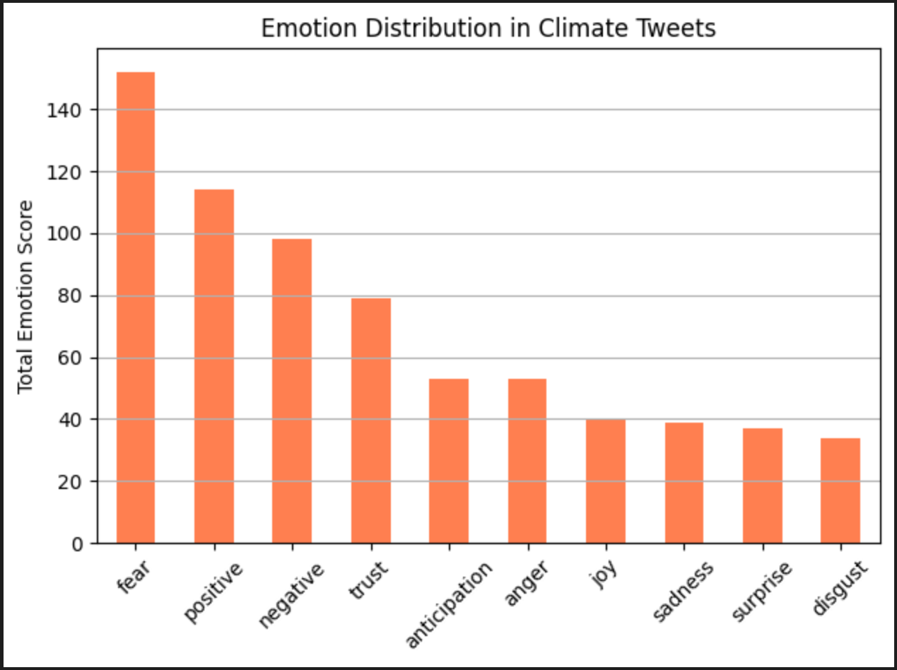

# TweetLens: Exploring Climate Conversations on Twitter
Climate change is more than a scientific issue — it’s a conversation. People tweet about it every day, expressing concern, skepticism, hope, and outrage. TweetLens is a data-driven project that analyzes real and synthetic climate-related tweets to uncover sentiment, emotion, and linguistic patterns in public discourse.

## 🔍 Project Overview
This project explores climate change conversations at scale using:

Real tweets fetched via the Twitter API (Tweepy)

Synthetic tweets generated using GPT-2 (Hugging Face Transformers)

Text analysis using sentiment and emotion detection tools

Visualizations to summarize patterns, public attitudes, and concerns

## 🛠 Project Context
This project was conducted under the Build Fellowship program, under the guidance of Shruti Adoni. The fellowship provided mentorship and a structured framework to explore data analytics and machine learning applications in real-world contexts.

## 📦 Features
Fetch real tweets about climate change, excluding retweets

Generate 10,000+ synthetic tweets mimicking real conversations

Visualize insights using WordClouds, sentiment histograms, and emotion bar charts

Analyze tweet content using NLP techniques: TextBlob and NRCLex

## 🧠 Technologies Used
Python (Pandas, Matplotlib, RegEx)

Tweepy (Twitter API v2)

Hugging Face Transformers (DistilGPT2)

TextBlob (Sentiment Analysis)

NRCLex (Emotion Analysis)

WordCloud

## 📁 Project Structure

tweetlens/
├── fetch_tweets.py           # Real tweet collection using Tweepy
├── generate_tweets.py        # GPT-2 based tweet generator
├── sentiment_analysis.py     # TextBlob-based polarity scoring
├── emotion_analysis.py       # NRCLex-based emotion scoring
├── wordcloud_visualizer.py   # WordCloud visualization
├── TwitterClimateData.csv    # Real tweets dataset
├── synthetic_tweets.csv      # GPT-2 generated tweets
├── .env                      # Environment variables for sensitive data
├── requirements.txt          # Python dependencies
├── .gitignore                # Files to be excluded from version control
└── README.md                 # Project documentation

## 📊 Key Insights

### 🌐 WordCloud
Most used terms: climate, change, risk, hoax, ecosystem

Shows polarized discussions—from activism to misinformation

### 😊 Sentiment Analysis
Most tweets are neutral, with a slight skew toward positivity

Positive tweets indicate hope, innovation, and support

Negative tweets reflect anxiety, criticism, or skepticism

### 😨 Emotion Analysis
Fear is the most dominant emotion

Balanced by trust, positive sentiment, and anticipation

Indicates deep emotional engagement around climate topics

### 🔬 Sample Visuals
📌 WordCloud
Visualizes dominant vocabulary in climate tweets

📌 Sentiment Histogram
Shows polarity scores across tweet data

📌 Emotion Bar Chart
Quantifies emotional signals from tweet content

## 🌱 Why TweetLens?
Understanding public perception is critical to shaping climate communication strategies. TweetLens transforms fragmented tweets into structured insights that can help policy makers, climate activists, and researchers navigate public sentiment.

## 📌 Future Enhancements
Topic modeling with LDA or BERTopic

Real-time tweet stream analysis

Dashboard using Streamlit

Multi-language tweet support